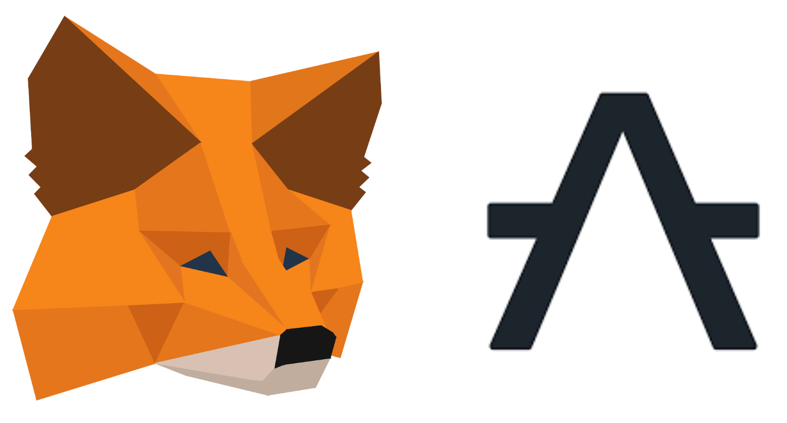

# ethwarsaw-2022

## Aleph Zero Snap



This repository contains a submission for EthWarsaw 2022 hackathon.

It contains an implementation of a wallet compatible with Aleph Zero protocol. The wallet is implemented using the polkadot.js library and MetaMask snaps plugin system.

Very short [presentation](https://docs.google.com/presentation/d/1pPtF-f4BSGIugyuOD2kFHIo5jazfBHT_QiJupiPOEd4/edit?usp=drive_web&ouid=113877850519058332016).

## Project Structure

The project is structured as follows:

- `azero-snap` - Contains implementation of the wallet "backend"
- `azero-snap/packages/snap` - The actual snap implementation
- `azero-snap/packages/snap-adapter` - User-facing API for the snap
- `polkadot-apps` - Contains implementation of the wallet "frontend". This yarn workspace is the fork of the [`azero.dev` wallet](https://github.com/Cardinal-Cryptography/apps)

## Usage

To install, run:

```bash
yarn install
```

To run the snap, run:

```bash
yarn build
```

To run wallet locally (in development mode), run:

```bash
yarn start
```

## Installing MetaMask Flask

In order to use snaps, we need to install [MetaMask Flask](https://metamask.io/flask/) extension:

- Checkout [MetaMask extension](https://github.com/MetaMask/metamask-extension) that support MetaMask Flask: We're currently using tag `v10.14.0-flask.0`
- Copy the .metamaskrc.dist file to .metamaskrc
  - Replace the INFURA_PROJECT_ID value with your own personal Infura Project ID.
- Build the extension locally: `yarn setup && yarn dist --build-type flask`
- Load the unpacked extension (see "custom build" instructions)
  from [here](https://github.com/MetaMask/metamask-extension/tree/eth-denver-2022#other-docs)
